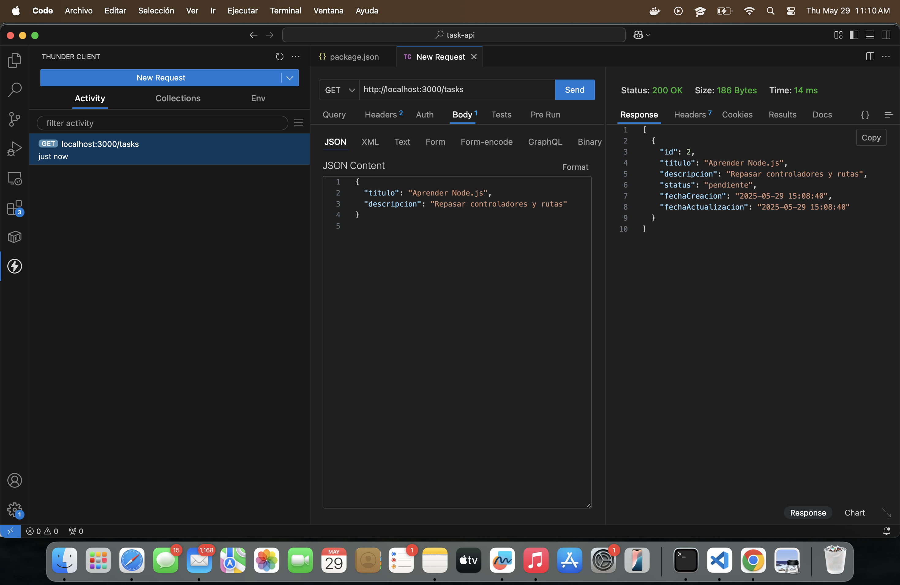
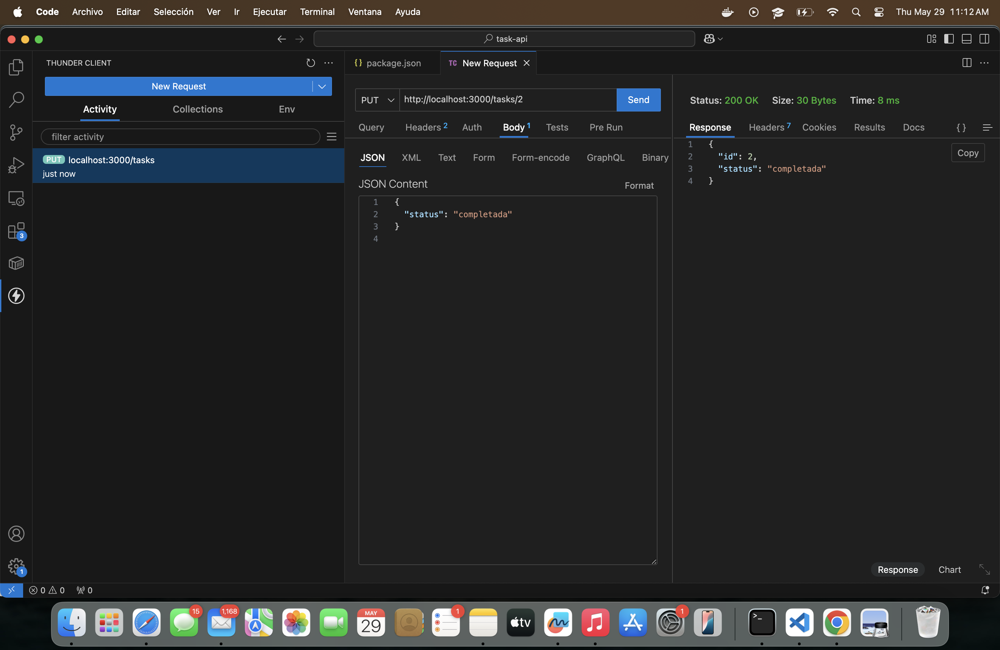
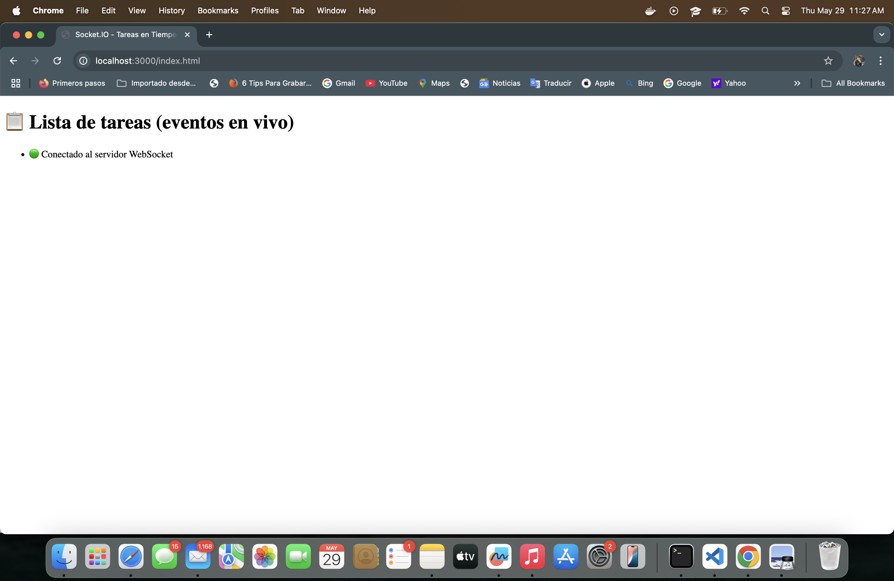
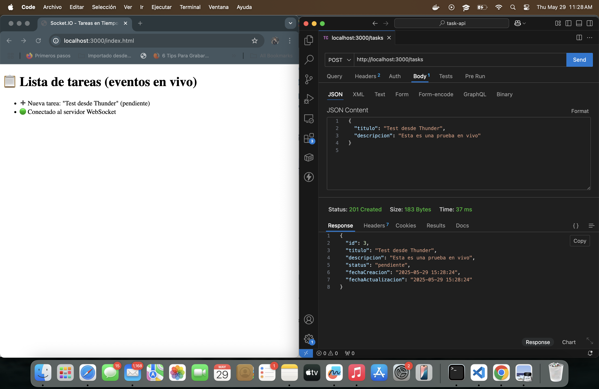
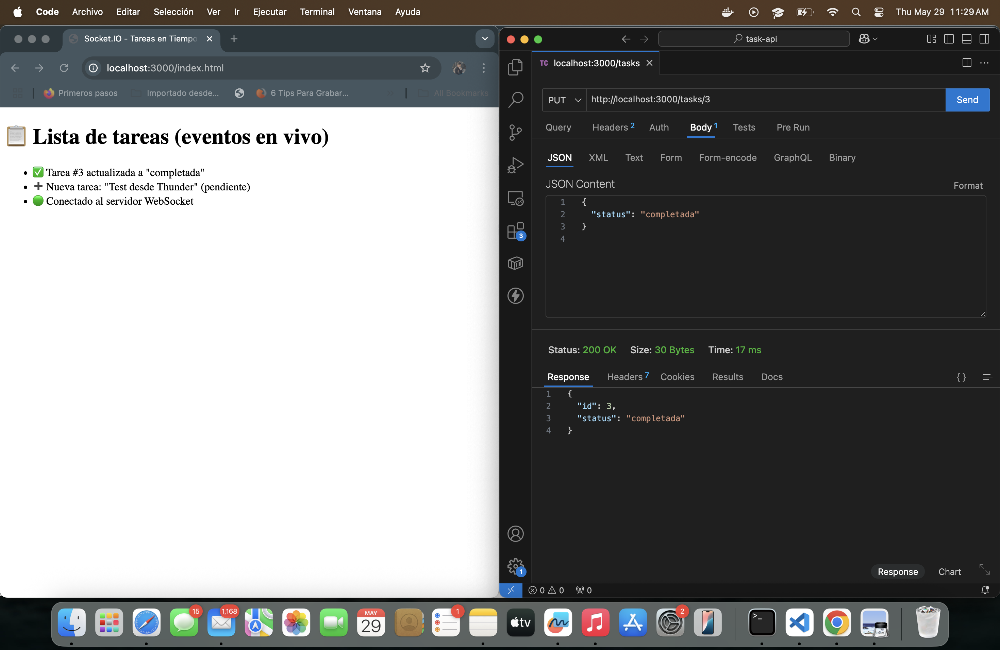
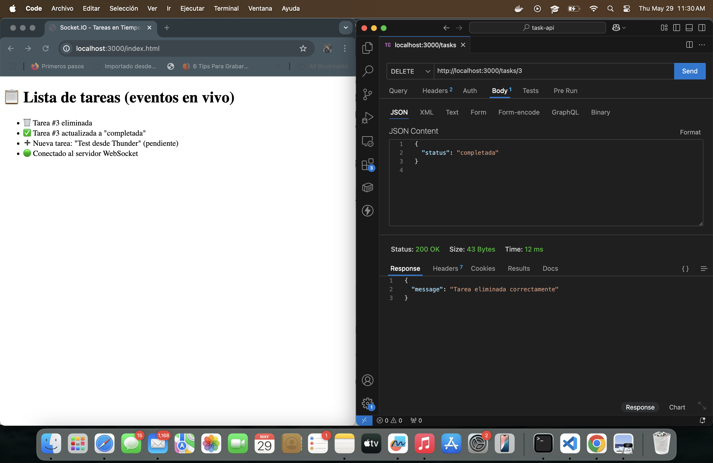

# API de Gestión de Tareas (Node.js + Express + SQLite + Socket.IO)

Este proyecto es una API RESTful desarrollada con **Node.js**, **Express**, **SQLite** y **Socket.IO**, que permite gestionar tareas en tiempo real. Cumple con los requisitos técnicos de la prueba: creación, listado, actualización, eliminación y emisión de eventos por WebSocket.

---

## Funcionalidades implementadas

- Crear tareas (POST `/tasks`)
- Obtener todas las tareas (GET `/tasks`)
- Actualizar el estado de una tarea (PUT `/tasks/:id`)
- Eliminar una tarea (DELETE `/tasks/:id`)
- Envío de eventos en tiempo real usando WebSockets
- Cliente web básico para ver eventos en vivo

---

## Tecnologías utilizadas

- Node.js
- Express
- SQLite
- Socket.IO
- HTML + JS (frontend mínimo)
- Thunder Client (para pruebas)

---

## Estructura del proyecto

```
task-api/
├── app.js
├── server.js
├── db/
│   └── database.js
├── routes/
│   └── tasks.js
├── controllers/
│   └── tasksController.js
├── sockets/
│   └── tasksSocket.js
├── public/
│   └── index.html
└── README.md
```

---

## Instalación del entorno

1. Clona el repositorio o descarga el `.zip`:

```bash
git clone https://github.com/santiagoAbasto/api-tareas-nodejs.git
cd task-api
```

2. Instala las dependencias:

```bash
npm install
```

3. Inicia el servidor en desarrollo:

```bash
npm run dev
```

> El servidor estará disponible en: `http://localhost:3000`

---

## 🔌 Endpoints de la API

### 📍 POST `/tasks`
Crear una nueva tarea.

```json
{
  "titulo": "Aprender Node.js",
  "descripcion": "Repasar controladores y rutas"
}
```

---

### 📍 GET `/tasks`
Obtener todas las tareas existentes.

---

### 📍 PUT `/tasks/:id`
Actualizar el estado de una tarea.

```json
{
  "status": "completada"
}
```

---

### 📍 DELETE `/tasks/:id`
Eliminar una tarea por su ID.

---

## Eventos WebSocket implementados

Los eventos se emiten automáticamente en las siguientes acciones:

| Evento        | Descripción                                      | Payload                        |
|---------------|--------------------------------------------------|--------------------------------|
| `newTask`     | Cuando se crea una nueva tarea                   | Objeto de tarea completo       |
| `taskUpdated` | Cuando se actualiza el estado de una tarea       | `{ id, status }`               |
| `taskDeleted` | Cuando se elimina una tarea                      | `{ id }`                       |

---

## Cliente Web para ver eventos en vivo

Se incluye una interfaz mínima en `public/index.html` para ver eventos en vivo conectados por Socket.IO.

### ✅ Cómo acceder:

```bash
http://localhost:3000/index.html
```

Este cliente muestra:

- Nueva tarea añadida
- Tarea actualizada
- Tarea eliminada

---

## 📷 Capturas de ejecución PRUEBAS SIN SOCKET

### SOLICITUD GET (THUNDER CLIENT)


### SOLICITUD POST (THUNDER CLIENT)


### SOLICITUD PUT (THUNDER CLIENT)


### SOLICITUD DELETE (THUNDER CLIENT)


---

## 📷 Capturas de ejecución frontend Socket en vivo

### 🟢 Cliente conectado


### 🆕 Crear tarea


### 🔄 Actualizar tarea


### 🗑️ Eliminar tarea


---

## 📌 Decisiones de diseño

- Se eligió **SQLite** por simplicidad en pruebas técnicas y facilidad de integración sin servidores externos.
- La arquitectura se dividió en rutas, controladores y base de datos para mantener escalabilidad.
- Se utilizaron funciones globales `emitX` en WebSocket para facilitar su invocación desde cualquier controlador.

---

## 🧪 Cómo probar sin frontend (opcional)

Si deseas verificar los eventos WebSocket sin `index.html`, puedes usar `wscat`:

```bash
npx wscat -c ws://localhost:3000
```

---

##  Autor

Desarrollado por: **Santiago Alfredo Abasto Ortega**  
🔧 Estudiante de Ingeniería de Sistemas - UCATEC  
📫 Contacto: [https://github.com/santiagoAbasto]